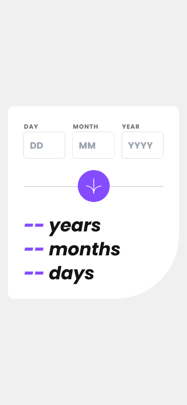
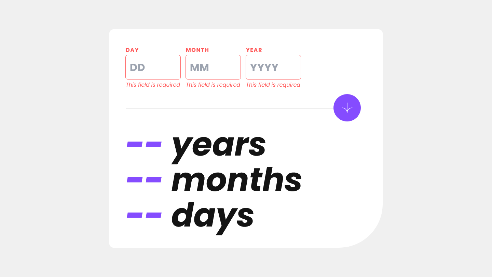
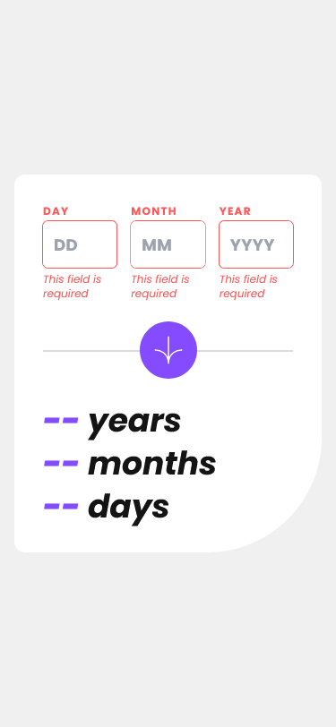
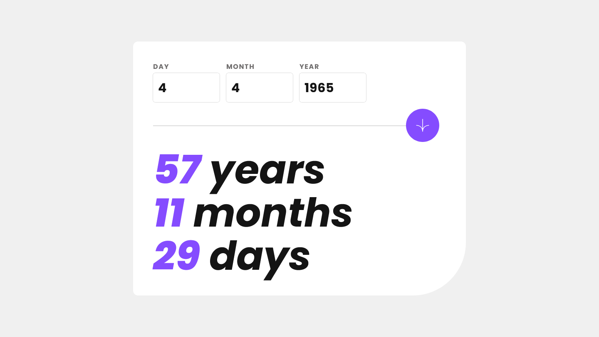
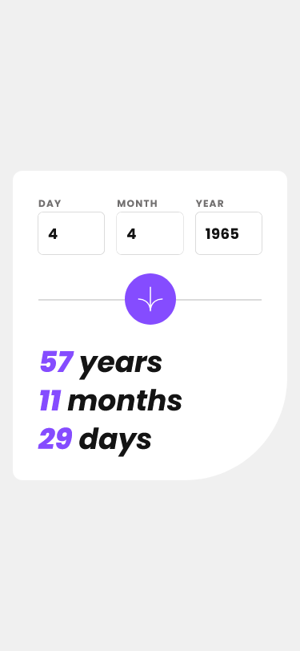

# Frontend Mentor - Age calculator app solution

This is a solution to the
[Age calculator app challenge on Frontend Mentor](https://www.frontendmentor.io/challenges/age-calculator-app-dF9DFFpj-Q).
Frontend Mentor challenges help you improve your coding skills by building
realistic projects.

## Table of contents

-   [Overview](#overview)
    -   [The challenge](#the-challenge)
    -   [Screenshot](#screenshot)
    -   [Links](#links)
-   [My process](#my-process)
    -   [Built with](#built-with)
    -   [Useful resources](#useful-resources)
-   [Author](#author)

## Overview

### The challenge

Users should be able to:

-   View an age in years, months, and days after submitting a valid date through
    the form
-   Receive validation errors if:
    -   Any field is empty when the form is submitted
    -   The day number is not between 1-31
    -   The month number is not between 1-12
    -   The year is in the future
    -   The date is invalid e.g. 31/04/1991 (there are 30 days in April)
-   View the optimal layout for the interface depending on their device's screen
    size
-   See hover and focus states for all interactive elements on the page
-   **Bonus**: See the age numbers animate to their final number when the form
    is submitted

### Screenshot

| Desktop                            | Mobile                                   |
| ---------------------------------- | ---------------------------------------- |
| Design                             |                                          |
|      |             |
| Error State                        |                                          |
|   |   |
| Result State                       |                                          |
|  |  |

### Links

-   [Solution](https://github.com/ShivangamSoni/age-calculator)
-   [Live Site](https://shivi-age-calculator.netlify.app/)

## My process

### Built with

-   HTML5
-   CSS3
-   [TypeScript](https://www.typescriptlang.org/)
-   [TailwindCSS](https://tailwindcss.com/) - For Styles
-   [React](https://react.dev/) - JS library
-   [Vite](https://vitejs.dev/) - For Development & Project Bundling
-   [React Hook Form](https://react-hook-form.com/) - For Form Handling
-   [Yup](https://github.com/jquense/yup) - For Form Validation

### Useful resources

-   [StackOverflow Answer](https://stackoverflow.com/a/54262003/16659219) - I've
    used this Scrip for Calculating the Age.

## Author

-   [Shivangam Soni](https://shivangam-soni.vercel.app/)
-   Frontend Mentor -
    [@ShivangamSoni](https://www.frontendmentor.io/profile/ShivangamSoni)
-   GitHub - [@ShivangamSoni](https://github.com/ShivangamSoni)
